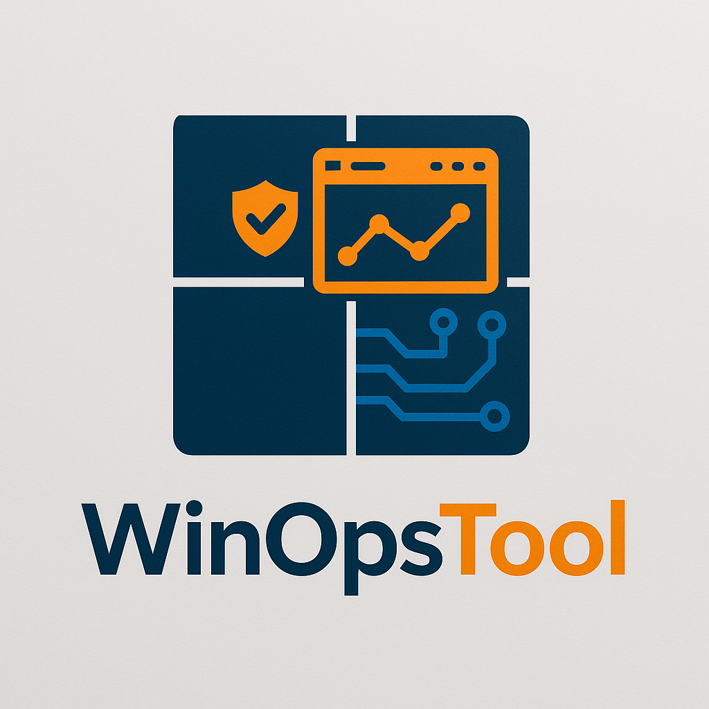
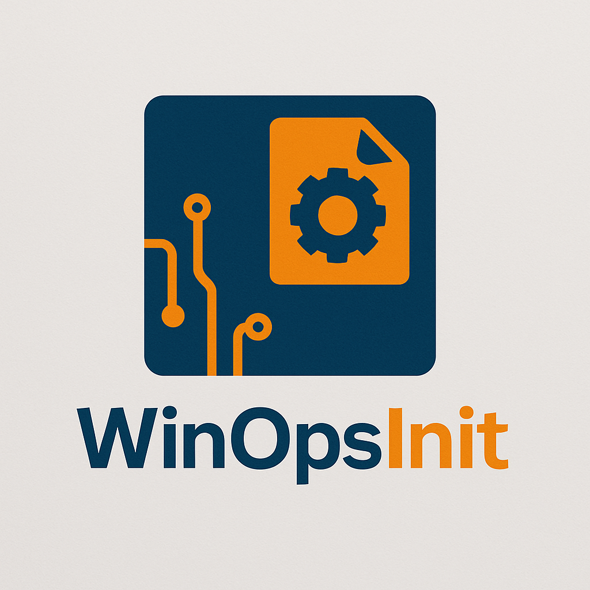

# WinOpsTool

<p align="center">
  
</p>

This suite consists of two complementary applications for comprehensive Windows system management:

## 1. WinOpsTool (main.py)

A powerful GUI application for managing and configuring Windows systems locally and remotely.

### Features
- Software Installation/Uninstallation
- Environment Variables Management
- Registry Editor
- Users & Groups Management
- Services Control
- Firewall Rules Configuration
- File/Folder Permissions
- Application Management
  - Processes monitoring and control
  - Startup items management
- Disk Management
  - Volume information
  - Network drive mapping
  - Disk details and health
- Drivers Management
  - Driver information and status
  - Driver operations
- Network Management
  - Network adapter configuration
  - Connection status
- Packages Management
  - Installed packages information
  - Package operations
- Process Management
  - Detailed process information
  - Process control
- Task Scheduler
  - View and manage scheduled tasks
  - Create and modify tasks
- Event Viewer
  - Browse Windows event logs
  - Filter and view event details
- Remote PC Management
- Configuration Import
- Logging and Error Handling
- User-configurable log level

### Key Capabilities
- Apply changes to multiple remote PCs simultaneously
- Import configuration files for automated setup
- Backup and restore system settings
- Elevated privileges handling
- Modern Qt-based interface

## 2. WinOpsInit (config_manager.py)

<p align="center">
  
</p>

A dedicated tool for creating and managing configuration files that can be imported into the main WinOpsTool.

### Features
- Environment Variables Configuration
  - System and user variables
  - Variable name and value management

- Registry Editor
  - Support for common registry types (REG_SZ, REG_DWORD, etc.)
  - Hierarchical registry path view

- Users & Groups Management

## Requirements

- Windows 10/11
- Python 3.8 or higher
- Administrator privileges
- Dependencies listed in requirements.txt

## Installation

### Option 1: Using Executables

1. Download the latest release from the Releases page
2. Extract the ZIP file
3. Run the executables with administrator privileges:
   - `SystemManagementTool.exe` - Main application
   - `ConfigurationManager.exe` - Configuration tool

### Option 2: From Source

1. Clone the repository:
   ```bash
   git clone https://github.com/yourusername/windows-system-management.git
   cd windows-system-management
   ```

2. Install dependencies:
   ```bash
   pip install -r requirements.txt
   ```

3. Run the Python scripts or build executables:
   ```bash
   # Run Python scripts
   python main.py
   python config_manager.py

   # Or build executables
   python build.py
   ```

### Building Executables

To create standalone executables:

1. Ensure PyInstaller is installed (included in requirements.txt)
2. Run the build script:
   ```bash
   python build.py
   ```
3. Find the executables in the `dist` directory:
   - `main.exe` - System Management Tool
   - `config_manager.exe` - WinOpsInit

## Usage

### Main Application

1. Run with administrator privileges:
   ```bash
   python main.py
   ```

2. Use the various tabs to manage different aspects of the system:
   - Configure environment variables
   - Edit registry settings
   - Manage users and groups
   - Control services
   - Configure firewall rules
   - Install/uninstall software
   - Set file permissions
   - Manage applications (processes and startup items)

3. For remote management:
   - Use Remote -> Manage Connections
   - Add remote PC connections
   - Apply changes to multiple systems

### WinOpsInit

1. Launch WinOpsInit:
   ```bash
   python config_manager.py
   ```

2. Create configurations:
   - Use the tabs to configure different aspects
   - Save configurations as YAML files
   - Import existing configurations
   - Use templates from the config directory

## Configuration Files

- Stored in YAML format
- Default template provided in `config/default.yaml`
- Can be edited manually or through WinOpsInit
- Support all configurable aspects of the system

## Architecture

The Windows System Management Tool follows a modular architecture pattern for maintainability, testability, and clean separation of concerns:

### Panel Structure

1. **Backend Logic**
   - `manager.py`: Handles Windows API operations and business logic
   - Error handling and logging
   - Clean separation from UI

2. **UI Components**
   - Reusable components in dedicated directories
   - Button components with consistent signal/slot patterns
   - Tree widgets for data display
   - Dialogs for user input

3. **Panel Integration**
   - `panel.py`: Coordinates UI and backend
   - Proper initialization order (resources → UI → connections → data loading)
   - Consistent BasePanel inheritance pattern

### Modularized Panels

All panels follow the same consistent pattern:
- **Applications Panel**: Processes and Startup tabs with modular components
- **Firewall Panel**: Inbound and Outbound rules with tabbed interface
- **Software Panel**: Installation and management components
- **Permissions Panel**: File system permission management
- And more...

## Best Practices

1. **Safety First**
   - Always run with administrator privileges
   - Back up system settings before making changes
   - Test configurations on non-production systems

2. **Remote Management**
   - Ensure network connectivity
   - Verify remote PC credentials
   - Test connections before applying changes

3. **Configuration Management**
   - Use templates for consistent configurations
   - Validate configurations before applying
   - Keep configuration files under version control

## Troubleshooting

- Check the logs directory for detailed logs
- Adjust log verbosity via Tools -> Settings to control the amount of log information
- Use Help -> Help Contents for detailed documentation
- Ensure all dependencies are correctly installed
- Verify administrator privileges

## Contributing

1. Fork the repository
2. Create a feature branch
3. Commit your changes
4. Push to the branch
5. Create a Pull Request

## License

MIT License - See LICENSE file for details
